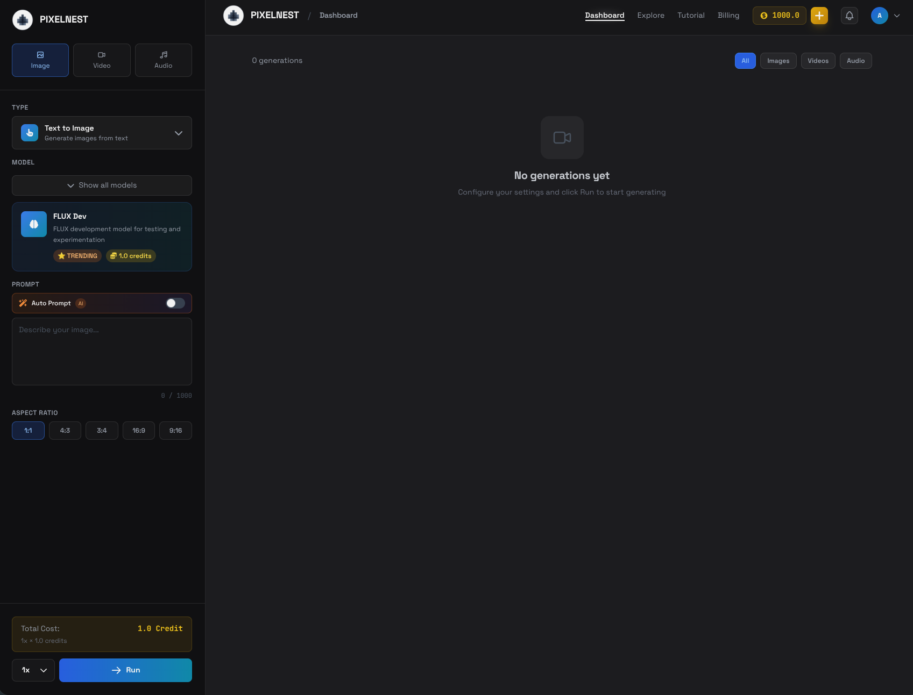
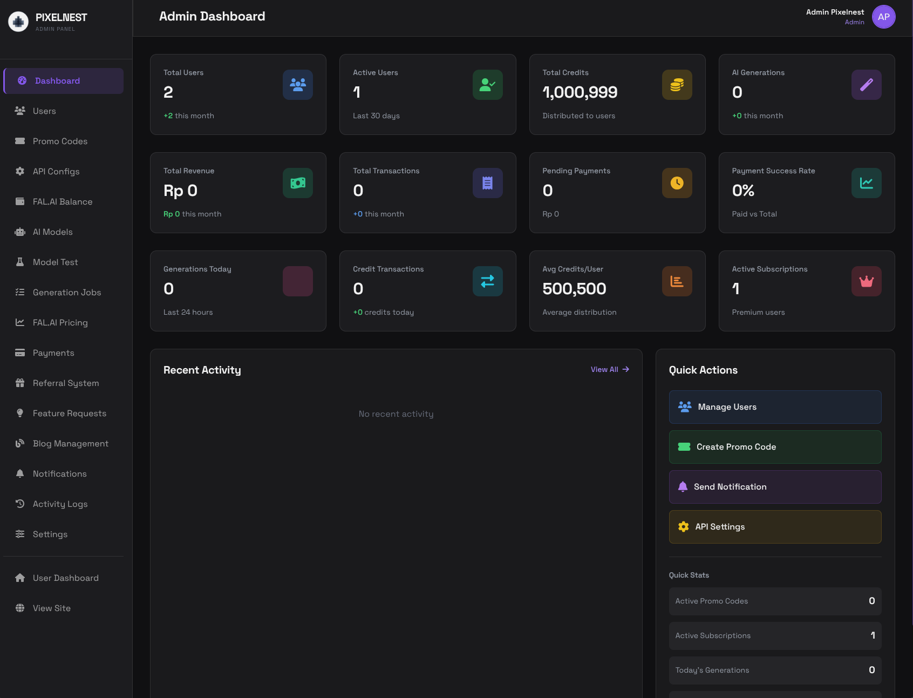

# PixelNest AI Automation Platform

Modern AI automation website built with Node.js, Express, EJS, and PostgreSQL.

## 🚀 Features

- **Modern UI/UX**: Clean, responsive design inspired by modern AI automation platforms
- **Server-Side Rendering**: Fast page loads with EJS templates
- **PostgreSQL Database**: Robust data management
- **RESTful API**: Clean architecture with MVC pattern
- **Responsive Design**: Mobile-first approach
- **Contact Forms**: Easy lead generation
- **Blog System**: Content management for articles
- **Service Catalog**: Dynamic service listings
- **Pricing Plans**: Flexible pricing display
- **Testimonials**: Social proof sections

## 📸 Screenshots

### User Dashboard


### Admin Dashboard


## 📋 Prerequisites

Before you begin, ensure you have the following installed:

- **Node.js** (v14 or higher)
- **PostgreSQL** (v12 or higher)
- **npm** or **yarn**

## 🛠️ Installation

### 1. Clone or navigate to the project

```bash
cd /Users/ahwanulm/Desktop/PROJECT/PIXELNEST
```

### 2. Install dependencies

```bash
npm install
```

### 3. Configure environment variables

Copy the `.env.example` file to `.env`:

```bash
cp .env.example .env
```

Edit the `.env` file with your configuration:

```env
PORT=5005
NODE_ENV=development

# Database Configuration
DB_HOST=localhost
DB_PORT=5432
DB_NAME=pixelnest_db
DB_USER=pixelnest
DB_PASSWORD=your_password_here

# Session Secret
SESSION_SECRET=pixelnest-secret-key-change-in-production
```

### 4. Set up PostgreSQL database

Create a new PostgreSQL database user and database:

```bash
# Create a superuser role 'pixelnest' (skip if you already have it)
sudo -u postgres createuser -s pixelnest

# Create the database owned by 'pixelnest'
sudo -u postgres createdb -O pixelnest pixelnest_db
```

### 5. Initialize the database

Run the comprehensive database setup script:

```bash
npm run setup-db
```

This will automatically create **ALL** required tables:
- ✅ Authentication tables (users, sessions)
- ✅ Basic tables (contacts, services, blog, etc.)
- ✅ Admin tables (promo codes, notifications, etc.)
- ✅ AI models and generation history
- ✅ Payment and transaction tables
- ✅ Referral system tables

**Verify everything is set up correctly:**

```bash
npm run verify-db
```

This will check if all required tables exist.

### 6. Default Admin Account

During the `setup-db` process, a default admin account is automatically created:

- **Email:** `admin@pixelnest.id`
- **Password:** `andr0Hardcore`

*(Please change this password after your first login!)*

## 🚀 Running the Application

### Development Mode

```bash
npm run dev
```

This will start the server with nodemon for auto-reloading on file changes.

### Production Mode

```bash
npm start
```

The application will be available at `http://localhost:5005`

For detailed deployment instructions, see [DEPLOYMENT_GUIDE.md](DEPLOYMENT_GUIDE.md)

## 🔄 Database Management

### Setup New Database
```bash
npm run setup-db     # Create all tables
npm run verify-db    # Verify all tables exist
```

### Reset Database
```bash
npm run reset-db     # Drop and recreate all tables
```

### Run Specific Migrations
```bash
npm run migrate:auth      # Users & sessions
npm run migrate:models    # AI models
npm run migrate:tripay    # Payment system
npm run init-admin        # Admin tables
```


## 📁 Project Structure

```
PIXELNEST/
├── public/                 # Static files
│   ├── css/               # Stylesheets
│   │   ├── main.css       # Main styles
│   │   └── responsive.css # Responsive styles
│   ├── js/                # Client-side JavaScript
│   │   ├── main.js        # Main scripts
│   │   └── pricing.js     # Pricing page scripts
│   └── images/            # Images and icons
│
├── src/                   # Source files
│   ├── config/           # Configuration files
│   │   ├── database.js   # Database connection
│   │   └── initDatabase.js # Database initialization
│   │
│   ├── controllers/      # Route controllers
│   │   ├── indexController.js
│   │   ├── servicesController.js
│   │   ├── pricingController.js
│   │   ├── contactController.js
│   │   └── blogController.js
│   │
│   ├── models/          # Database models
│   │   ├── Service.js
│   │   ├── PricingPlan.js
│   │   ├── Testimonial.js
│   │   ├── Contact.js
│   │   └── BlogPost.js
│   │
│   ├── routes/          # Route definitions
│   │   ├── index.js
│   │   ├── services.js
│   │   ├── pricing.js
│   │   ├── contact.js
│   │   └── blog.js
│   │
│   └── views/           # EJS templates
│       ├── partials/    # Reusable components
│       │   ├── header.ejs
│       │   └── footer.ejs
│       ├── index.ejs
│       ├── services.ejs
│       ├── pricing.ejs
│       ├── contact.ejs
│       ├── blog.ejs
│       ├── 404.ejs
│       └── error.ejs
│
├── .env.example         # Environment variables template
├── .gitignore          # Git ignore rules
├── package.json        # Dependencies and scripts
├── server.js          # Application entry point
└── README.md          # This file
```

## 🗄️ Database Schema

### Tables

- **services**: Service catalog
- **pricing_plans**: Pricing information
- **testimonials**: Customer testimonials
- **contacts**: Contact form submissions
- **blog_posts**: Blog articles
- **newsletter_subscribers**: Email subscribers

## 🎨 Customization

### Styling

- Main styles: `public/css/main.css`
- Responsive styles: `public/css/responsive.css`
- Color scheme can be customized in CSS variables

### Content

- Edit EJS templates in `src/views/`
- Modify database seed data in `src/config/initDatabase.js`

## 📝 API Endpoints

### Pages

- `GET /` - Home page
- `GET /services` - Services listing
- `GET /services/:slug` - Service detail
- `GET /pricing` - Pricing page
- `GET /contact` - Contact page
- `GET /blog` - Blog listing
- `GET /blog/:slug` - Blog post detail

### Forms

- `POST /contact` - Submit contact form

## 🔒 Security Features

- Helmet.js for security headers
- Input validation with express-validator
- SQL injection protection with parameterized queries
- Session management
- CORS configuration

## 🚀 Deployment to VPS (Ubuntu)

The project includes a fully automated deployment script that configures a remote Ubuntu VPS (20.04/22.04), installs all dependencies (Node.js, PostgreSQL, Nginx, PM2, Certbot), sets up the database, and configures SSL.

### 1. Build the Deployment Package

Run the following command to bundle your code into a `.zip` or `.tar.gz` file:
```bash
npm run deploy:zip
```

### 2. Run the Auto-Deploy Script

Run the deployment script and follow the interactive prompts:
```bash
npm run deploy:vps
```

You will be asked to enter:
- Your domain name (e.g., `pixelnest.id`)
- SSH username (e.g., `root`)
- VPS IP address
- SSH port (usually `22`)

The script will automatically upload the package, connect to your VPS, and set up the entire tech stack and database from scratch.

### 3. Post-Deployment (Final Steps)

Once the script completes, connect to your server to update the `.env` file with your specific API keys:
```bash
ssh root@<YOUR_VPS_IP>
nano /var/www/pixelnest/.env
```
*(Add specific variables like `FAL_KEY`, `TRIPAY_API_KEY`, etc.)*

Then, restart the application so it picks up the new environment variables:
```bash
pm2 restart pixelnest
```

## 📦 Dependencies

### Main Dependencies

- **express**: Web framework
- **ejs**: Template engine
- **pg**: PostgreSQL client
- **dotenv**: Environment variables
- **helmet**: Security headers
- **compression**: Response compression
- **express-validator**: Input validation

### Dev Dependencies

- **nodemon**: Auto-restart server

## 🐛 Troubleshooting

### Database Connection Issues

If you can't connect to PostgreSQL:

1. Check if PostgreSQL is running: `pg_isready`
2. Verify credentials in `.env`
3. Ensure database exists: `psql -U postgres -l`

### Port Already in Use

If port 5005 is in use:

1. Change PORT in `.env`
2. Or kill the process: `lsof -ti:5005 | xargs kill`

## 📄 License

MIT License

## 🤝 Contributing

Contributions are welcome! Please feel free to submit a Pull Request.

## 📧 Contact

For questions or support, please contact: hello@pixelnest.ai

---

**Built with ❤️ using Node.js + Express + EJS + PostgreSQL**

# ai-pixelnest
